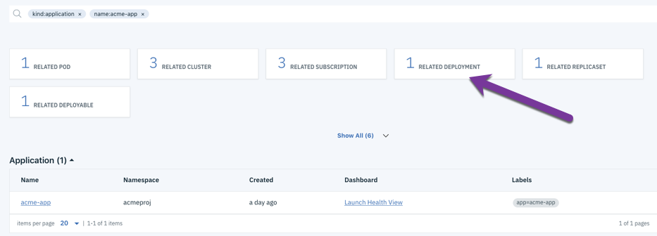

# Chicago Public Market K8 - Project
# Application promotion model with multiple clusters

This project looks at  the application deployment and promotion model within IBM Multi Cluster Manager (MCM).
This project takes a look at how the Applications, Channels, Subscriptions and Deployables can be used to manage and promote appications across multiple clusters.

The resources defined below are done so in the context of a ficticious application called "acmeapp".
All the resources use "acme" in their names, namespaces, and other metadata as a way to identify the resource belonging to the acme application.
The applicaiton is completely ficticous and really is just using a standard nginx container as the deployable asset. 
The purpose of this exercise is to illustrate the application model in MCM as opposed to any functionality of the deployed application. Any application could be used for this pupose.

Although this example will initiate deployments by manually changing values in a yaml file, this could be done as part of a CICD process in an automated fashion by editing the Kubernetes resource.

# Technology used in this project

* IBM Multi Cloud Manager: https://www.ibm.com/cloud/multicloud-manager
* RedHat OKD: https://www.okd.io/

For this project, a MCM hub cluster was used that managed two OKD clusters. https://www.okd.io/

The MCM cluster served solely as a management hub cluster. The two OKD clusters servered as the potential deployment targets.
For the purposes of this project, one of the OKD clusters was considered a Dev cluster and the other a Production level cluster.

# Prerequisits

If you want to use this as an example, make sure you have the following in place.

1) IBM Multi Cloud Manager Installed
2) At least two target clusters. This example uses OKD clusters but tis example should work with any Kubernetes cluster that is supported by IBM MCM
3) ability to clone a git repository
4) The proper CLI tools installed (kubectl, git, etc)
5) your kubectl is configured to point to your MCM hub cluster
 
# Concepts

The application deployment model employed by MCM is that of using a combination of Applications, Subscriptions, Channels and Deployable objects to manage
the deployment of applications. The below provides a brief overview of these objects.

An overview of the application model itself can be found here: https://www.ibm.com/support/knowledgecenter/SSFC4F_1.1.0/mcm/applications/app_lifecycle.html


Applications: 
Applications are used to group together the different components that make up the overall application.
The Application definition uses selector matching in its yaml defintion to select what components will be included as part of the application.

Deployables:
Deployables are used as a wrapper to the Kubernetes or Helm artifacts that make up the assets that get deployed to the target clusters. 
The Deployable resource allows the MCM hub cluster to be aware of the the artifacts that neeed to be deployed and allows the deployment to occur to one or more target clusters once a proper match is made as to which cluster or clusters will be the actual target.

Channel:
Channels are used to point to the source of the actual deployable artifacts. Channels can be one of three type: Namespace, Helm or ObjectStore.
In all cases the type of the channel indicates where it will look for possible artifacts that can be used for deployment.

This project uses a namespace channel. This means that any deployables in a namespace that the channel knows about could be possible candidates for deployment.
The Channel can also use a gate defined by annotations to further filter out which deployable resources the channel will identify.

Subscriptions:
Subscriptions (Subscription.app.ibm.com) are Kubernetes resources that serve as sets of definitions for identifying deployables within channels by using annotations, labels, and versions. Subscription resources reside on the managed cluster and can point to a channel or storage location for identifying new and updated deployables, such as Helm releases or Kubernetes resources for deployment. 
Subscriptions also can define placement rules as to where the deployables can be placed or deployed.
Once a subscription identifies the proper deployables that match the given criteria, they can be deployed to the target clusters.
 
The relationship of these objects is illustrated in the following diagram:


# How the Applicaiton model in MCM works.
In this project, two clusters, an Application, two channels, two subscriptions and one deployable were created.
This was the minimum number of resources needed to illustrate how the application model in Multi Cloud Manager works and be able to deploy to more than one cluster..

Clusters:
The two target clusters were OKD clusters and were both managed by the MCM hub cluster. The configuration of the two target cluster was irrelevant to this exercise. 
The clusters were identified both by name and purpose.

Cluster Name:      Purpose:
lancel             development cluster
kevan              production cluster

This was a simple example where we will be choosing the placement of our deployments by clustername.
More advanced cluster selection techniques are possible through the use placement rules.  
Placement rules are discussed here: https://www.ibm.com/support/knowledgecenter/SSFC4F_1.1.0/mcm/applications/managing_placement_rules.html


Application:
The application is defined through the file named acmeapp.yaml.
```
apiVersion: app.k8s.io/v1beta1
kind: Application
metadata:
  name: acme-app
  namespace: acmeproj
  labels: 
    app: acme-app
spec:
  componentKinds:
  - group: app.ibm.com
    kind: Subscription
  selector:
    matchLabels:
      release: acme101
status: {}

```

In the above example, the application will be composed any subscription resource that happens to have the label of "acme101".
This allows MCM to identify which resources could make up the application.


Subcription. 
The development and production subscription are defined in the dev-sub.yaml and prod-sub.yaml files respectively. The only significant differences in the definitions will be the package filter 
annotationed used to identify potential resoruces and the target cluster for the placement.

Below the development subscription is shown.  

```
apiVersion: app.ibm.com/v1alpha1
kind: Subscription
metadata:
  name: acmeproj-dev-sub
  namespace: acmeproj
  labels:
    release: acme101
    app: acme-app
spec:
  channel: acmeproj/acmeproj-dev
  packageFilter: 
    annotations:
      dev-ready: approved
  placement:
    clusters:
    - name: lancelcluster

```

In the above example, we see that the subscription will be looking at the acmeproj/acmeproj-dev channel. This is of the form &lt;namespace&gt;/&lt;channel name&gt;.
This subscription will also be looking for packages (deployables) that carry the annotation of dev-ready = approved. This is an indication that the given deployable is 
approved for moving to a development cluster.

Finally, the placement rules used is merely a simple rule by targeting a particular cluster by name. In this case 'lancelcluster' is our development cluster.

If we look at the development channel yaml file, we see this:
```
apiVersion: app.ibm.com/v1alpha1
kind: Channel
metadata:
  name: acmeproj-dev
  namespace: acmeproj
  labels:
    app: acme-app
    release: acme101
spec:
  sourceNamespaces: 
  - acmeproj
  type: Namespace
  pathname: acmeproj
  gates:
    annotations:
      dev-ready: approved
```

Channels can look at three different sources for the resources to deploy: Helm repository, namespaces or object stores.
As the type field under the spec: section dictates, we are using a Namespace type channel for this example.
This tells the channel to look in the namespaces listed under the sourceNamesapce block for finding potential deployable artifacts.
In this example, that means any resource in the "acmeproj" namespace could be a potential candidate for this channel to pick as a deployable resource.

However, futher filtering is done throught the gates: block in the channel spec:. Here we see that a gate: is defined thta is looking for resources that have the dev-ready: approved annotation set. 

This channel will pick only deployable resources that are in the acmeproj namespace that have the dev-ready: approved annotation.


Deployable

The deployable used in this exercise is defined in the file nginx-deployable.yaml. 
Only part of that file is reproduced here. Please refer to the file itself for the full resource definition.
The parts of this definition show that it references an nginix image as the deployable asset.

```
apiVersion: app.ibm.com/v1alpha1
kind: Deployable
metadata:
  annotations:
    app.ibm.com/is-local-deployable: "false"
    dev-ready: notapproved
    prod-ready: notapproved
  name: acme-nginxfixed
  namespace: acmeproj
  labels:
    release: acme101
    app: acme-app
```

The interesting things to note in this Deployable definition are the annotations. In particular, the dev-ready and prod-ready keys and their values.
These will be used to illustrate how these can be used to control when these deployable resources get deployed to a cluster.

# Working Example.

To illustrate how you can deploy and promote applications in MCM, you can do the following. Verify you have met the requirements in the prerequisties section above

1) Create the acmeproj name space
``` kubectl create namespace acmeproj ```

2) create the two MCM channels
```
kubectl create -f dev-chan.yaml
kubectl create -f prod-chan.yaml
```

Verify these were created

```
kubectl get channel -n acmeproj

NAME            TYPE        PATHNAME   AGE
acmeproj-dev    Namespace   acmeproj   1d
acmeproj-prod   Namespace   acmeproj   1d

```
3) Create Deployable

```
kubectl create -f nginx-deployable.yaml
```

If you log onto MCM, you can run a search with kind: deployable to see this has been created. For unknown reasons this cannot verified at command line.


Result


Note the labels listed on the deployable on the far right. These are used by the application, channel and subscription to help identify this deployable should be picked up.


4) Create subscriptions

** note: before running these commands, change the cluster names in both dev-sub.yaml and prod-sub.yaml to match the names of your actual target clusters.


``` 
kubectl create -f dev-sub.yaml
kubectl create -f prod-sub.yaml
```

Verify the subscriptions were created.
```
kubectl get subscription -n acmeproj


NAME                STATUS       AGE
acmeproj-dev-sub    Propagated   1d
acmeproj-prod-sub   Propagated   1d
```

5) Create the Application

The application is defined in acmeapp.yaml. 

Create it by typing:
```
kubectl create -f acmeapp.yaml
```

Verify it gets created in two ways:
```
kubectl get application -n acmproj
```

This should return
```
NAME       AGE
acme-app   1d
```

you can also see this in MCM. Log in to MCM, and from the layer cake menu, select Applications.


If everything went well, you should see one deployable associated with this application. This does not mean that anything was deployed to the target clusters yet.
Seeing one deployable associated with the application only means a deployable resource was found that matched all the criteria required to be associated with the application.

Click on the application link for acme-app. This should show a picture similar to the below


This shows the topology for this application. In this case we are shown the two subscriptions on the left (acmeproj-dev and acmeproj-prod). 

6) deploy app to the dev cluster

Before deploying the application, log into your development target cluster and verify there are no deployments in the acmeproj namespace.
* Note: this was done from a shell that is configured to point to the dev clutster and not the MCM hub cluster

```
kubectl get nodes

NAME                          STATUS   ROLES                  AGE   VERSION
lancel.nip.io   Ready    compute,infra,master   72d   v1.11.0+d4cacc0
```

Above shows that we are running this command on lacel, our dev cluster.

```
kubectl get deployment -n acmeproj

No resources found in acmeproj namespace.

```
Since no resources of type deployment were found in the acmeproj namespace on our dev cluster, we know our application has not been deployed there yet.

As a reminder, only deployables that have a an attribute of "dev-ready: approved" will be picked up by our subscription and deployed.

To trigger a deployment, edit the deployable and change the value of the deployable. We will edit this in the MCM GUI but it could be done as part of a CICD pipeline by the build tool as well. 

Layercake menu-> Search. Type kind: deployable.
In the list locate "acme-nginxfixed

*Note: there will be other deployables that start with "acme". Those were created by the subscriptions but we need to change the original deployable so that it's picked up by the subscription.

Click on the acme-nginxfixed deployable

This will bring up the yaml definition for the deployable. The begining of the yaml defintion should look similar to the following.
```
apiVersion: app.ibm.com/v1alpha1
kind: Deployable
metadata:
  annotations:
    app.ibm.com/is-local-deployable: 'false'
    app.ibm.com/managed-cluster: /
    dev-ready: notapproved
    prod-ready: notapproved
```


Click the edit botton to the right of the page.

change "notapproved" to "approved" (i.e. remove "not") from the dev-ready line under the annotations block.
Click the save button. You will get a warning that saving the edited yaml file could affect the behavior of running applications. Click save button in the 
in the warning dialog.


After editing, the values for the attributes should read as below. This should trigger a deployment to the dev cluster.
```
apiVersion: app.ibm.com/v1alpha1
kind: Deployable
metadata:
  annotations:
    app.ibm.com/is-local-deployable: 'false'
    app.ibm.com/managed-cluster: /
    dev-ready: approved
    prod-ready: notapproved
```

Wait a bit of time (seconds or mins). In the command shell configured to your development cluster, type:
```
kubectl get deployment -n acmeproj

NAME         DESIRED   CURRENT   UP-TO-DATE   AVAILABLE   AGE
acme-nginx   1         1         1            1           1m

```

If you see the output above, this shows that the deployment has been triggered by MCM through changing of the attribute in the deployable yaml defintion.

You can also see this in the topology diagram of the application.
Click on Layercake menu->Applications->acme-app

The diagram now looks like the following. This now shows three nodes with the 3rd node being the actual deployment object.


Above the topology diagram, click on the resources tab


Under Resource highlights, click on the subscriptions box


Notice there is one related deployment (not deployable)
This is the deployment that is now running on the development cluster



Click on the deployment box.
This will show the related deployment(s) at the bottom and should look like the following:


This shows us the name of the deployment, the cluster it's running on and the number and state of deployment itself.


A similar exercise could be done by changing the value of the prod-ready attribute to approved. This will trigger a deployment to the production cluster.

# Remove application

Edit the deployable yaml definition again.

Layercake menu-> Search. Type kind: deployable.
In the list locate "acme-nginxfixed

*Note: there will be other deployables that start with "acme". Those were created by the subscriptions but we need to change the original deployable so that it's picked up by the subscript>

Click on the acme-nginxfixed deployable


This will bring up the yaml definition for the deployable.
Click the edit button to the right. change the value of dev-ready: approved to dev-ready: notapproved  (or anything except "approved")
Click save.

the yaml definition should look like:

```
apiVersion: app.ibm.com/v1alpha1
kind: Deployable
metadata:
  annotations:
    app.ibm.com/is-local-deployable: 'false'
    app.ibm.com/managed-cluster: /
    dev-ready: notapproved
    prod-ready: notapproved
```

Click save and also in the warning dialog.

This will mark our deployable as no longer suitable for deployment to our development cluster.

Wait a few seconds or minutes.

In the command shell configured to your development cluster, run:

```
kubectl get deployment -n acme-proj
```

You should get the output of:
```
No resources found in acmeproj namespace.
```

Note: if you still see a deployment, wait a bit longer.
Because our deployable now carries the annotation of dev-ready: notapproved, MCM will remove the deployment from our dev cluster.

We can see this in MCM as well.
Our application topology now looks like this:


Note that it only shows two nodes as the deployment was removed.

If you click on the resources tab for the application, we now see the following for the related resources:


## Acknowledgments

* Developed by Andy Moynahan, Paul Lucas, Dave Wakeman and Christina Churchill
* Thank you to our K8s enablement leaders!
